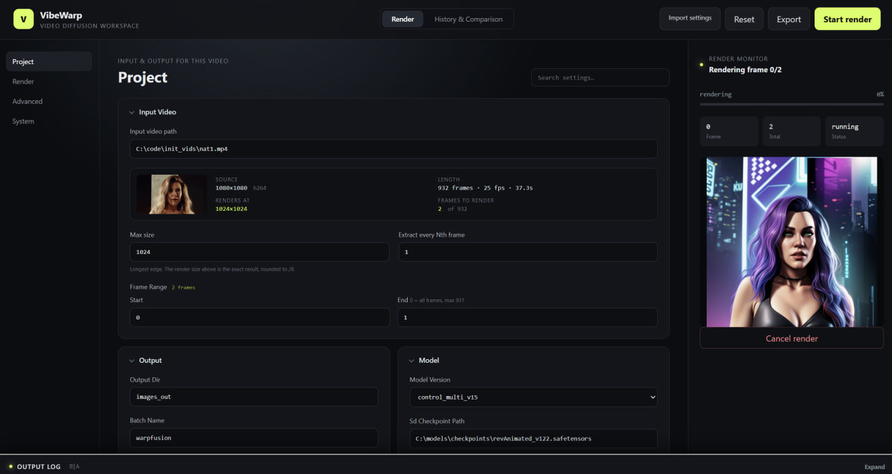
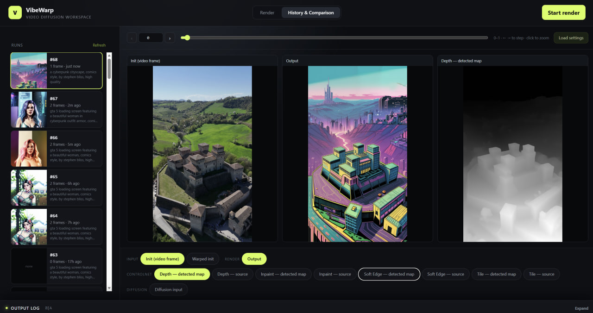

# VibeWarp — The Impressionism of video2video

[](https://github.com/Sxela/VibeWarp/actions/workflows/ci.yml)

Video-to-video style transfer, consolidated from [WarpFusion](https://github.com/Sxela/WarpFusion) v0.37 into a standalone Python package.

Feeds each frame of a video through Stable Diffusion, warping the previous render forward
along optical flow so every frame builds on the last instead of being redrawn from scratch.
The result is painterly and alive — it drifts, dissolves and reconstitutes.

That texture is the point, not an artefact of it. A video model will give you a clean,
coherent clip; this gives you something that looks made by hand.

Optical flow, consistency masks and ControlNets are the controls for *how much* it holds
together — turn them up for stability, down for dissolve.

## The interface

A local web UI (Svelte + FastAPI), started with `run-ui.bat` / `run-ui.sh`. There is a full
CLI too — see the [CLI reference](docs/cli.md).

**Render** — settings grouped by how you actually use them: what you set once per project,
what you change every run, and what you touch once or never. The input video is probed on
the spot, so the resolution and frame count shown are what the render will genuinely
produce, not an estimate.



**History & Comparison** — every past run, inspectable frame by frame and layer by layer:
the init frame, warped init, processed consistency mask, each ControlNet's source and
detected map, the diffusion input, and the output. Load any run's settings back into the
form to iterate on it. Cancelled runs keep their completed frames: resume from the first
missing frame, assemble a partial video at any time, and play assembled videos in place.
Ctrl/Cmd-click any two runs to compare every changed saved setting side by side.



## Documentation

- [CLI reference](docs/cli.md) — all flags, usage examples, model downloads, Python API, output layout
- [Settings reference](docs/settings.md) — WarpFusion settings mapping, schedules, consistency masks, video assembly, tiled VAE, noise modes, prompts/LORAs, vendored libraries
- [Architecture](docs/architecture.md) — render pipeline, settings flow, and dependency diagrams
- [GPU validation](docs/gpu-validation.md) — resumable notebook-parity suite and bulk reports
- [Roadmap and known gaps](docs/roadmap.md) — what is verified against the notebook, what is not, and where to help

## Requirements

- NVIDIA GPU with CUDA support (8 GB+ VRAM recommended)
- The one-click installer handles Python and ffmpeg for you (see below).
  For a manual install you also need Python 3.11+ and ffmpeg on PATH.

## Quickstart

### 1. Install

**One-click (recommended).** Downloads a private Python 3.14, ffmpeg, and all
dependencies into this folder — nothing touches your system Python:

- **Windows**: double-click `install.bat` (or run it from a terminal).
- **Linux/macOS**: `./install.sh`

Re-running is safe: completed steps are skipped. If your CUDA driver isn't
12.8, edit the `torch_index` (`.bat`) / `TORCH_INDEX` (`.sh`) line at the top
first — see https://pytorch.org/get-started/locally/.

<details>
<summary>Manual install (if you already manage your own Python/ffmpeg)</summary>

```bash
# virtual environment
python -m venv env
source env/bin/activate   # Linux/macOS
env\Scripts\activate      # Windows

# PyTorch matching your CUDA driver (example: CUDA 12.8)
pip install torch torchvision --index-url https://download.pytorch.org/whl/cu128

# VibeWarp + remaining dependencies
pip install -e .
```

Install ffmpeg from https://ffmpeg.org/download.html (Windows),
`sudo apt install ffmpeg` (Linux), or `brew install ffmpeg` (macOS).
</details>

Everything else is vendored in `vibewarp/vendor/` — no external git clones
needed.

After the one-click install, use the `run` launcher for everything below — it
activates the private environment and forwards all arguments to VibeWarp:
`run.bat <args>` (Windows) or `./run.sh <args>` (Linux/macOS). With a manual
install, use `python -m vibewarp <args>` inside your activated venv instead.

### 2. Get models

Downloads the checkpoint and all ControlNets referenced in your settings file:

```bash
run.bat --download-models --warpfusion-settings path/to/settings.txt
```

Models land in a `models/` folder under the current directory by default;
override with `--models-root`. See [docs/cli.md](docs/cli.md) for manual
download links.

The FLUX.2 and HiDream backends require a separate, current ComfyUI install.
Get it from the [official ComfyUI download page](https://www.comfy.org/download)
and update it before installing the models; both backends use native ComfyUI
nodes. Portable and manual-install users can use the
[official GitHub repository](https://github.com/Comfy-Org/ComfyUI).

For the experimental FLUX.2 Klein Edit path, start ComfyUI separately with its
Klein diffusion model, Qwen text encoder, and Flux2 VAE installed. Select
`model_version="flux2_klein_edit"`; VibeWarp connects to
`http://127.0.0.1:8188` by default. The server URL and Comfy-visible model
filenames are configurable under **System → Paths**. See
[Flux 2 Klein Edit setup and settings](docs/settings.md#flux-2-klein-edit) for
the exact Hugging Face downloads and destination folders.

For experimental pixel-space editing with HiDream-O1, put
`hidream_o1_image_fp8_scaled.safetensors` in ComfyUI's `models/checkpoints`
folder and select `model_version="hidream_o1_edit"`. No disjoint text encoder
is required for direct prompts; ComfyUI's optional Gemma 4 model is a prompt
enhancer, not the model's core conditioning encoder. See
[HiDream-O1 setup and settings](docs/settings.md#hidream-o1-edit) for the exact
Hugging Face download and destination folder.

### 3. Render with your WarpFusion settings

Use a settings file exported from the WarpFusion notebook as-is — the models
root is auto-inferred from the checkpoint path in the file:

```bash
run.bat --warpfusion-settings path/to/settings.txt --video input.mp4
```

Optionally override resolution or frame range on top of the settings:

```bash
run.bat --warpfusion-settings settings.txt --video input.mp4 --max-size 768 --end-frame 30
```

Rendered frames and the assembled video appear under
`images_out/<batch-name>/<run>/` ([details](docs/cli.md#output-layout)).

### Optional web UI

A Svelte web UI is available via `run-ui.bat` (Windows) / `./run-ui.sh`
(Linux/macOS). It installs the lightweight FastAPI server from the `[ui]`
extra on first launch and opens http://localhost:7860. The form is generated
from `RunConfig`, with full config import/export, validation, queued rendering,
live progress and logs, cancellation/resume, partial video assembly and playback, and
artifact previews.

Prefill the UI from structured JSON, a VibeWarp settings snapshot, or a
WarpFusion notebook settings file:

```bash
vibewarp-ui --settings path/to/settings.txt
```

The same files can be selected with **Import settings** after the UI opens.

The **Preview & Debug** tab replays a finished (or in-progress) run frame by
frame, showing the init video frame, the warped init, each ControlNet's source
image and detected map, the diffusion input, and the rendered output side by
side on a frame slider — so you can see exactly what a ControlNet was fed and
what it produced.

Cancelling does not discard rendered frames. In **History & Comparison**, use **Resume**
to continue the same run with its previous stylized frame restored, or **Make video** to
encode only the frames completed so far. **Play video** opens the result in the app.

The ControlNet panel lists every net the engine supports for your base model
(SD1.5 / SDXL), scans the model directory and tells you which checkpoints are
actually present *before* you start a render. See
[docs/settings.md](docs/settings.md#controlnet-modes-and-layer-weights) for how
the ControlNet `mode` relates to layer weights.

Editing the frontend requires a rebuild — the Svelte app is compiled into
`vibewarp/web_static/`, which is what the server actually serves:

```bash
cd webui && npm install && npm run build
```

## License

GPL-3.0 — see [LICENSE](LICENSE). Vendored third-party components are
in [THIRD_PARTY_LICENSES.md](THIRD_PARTY_LICENSES.md).

Based on [WarpFusion](https://github.com/Sxela/WarpFusion) by Alex Spirin (MIT).

## Contributing and security

See [CONTRIBUTING.md](CONTRIBUTING.md) for the development setup and test commands.
Please report vulnerabilities using the private process in [SECURITY.md](SECURITY.md).
