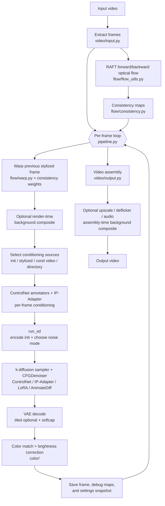
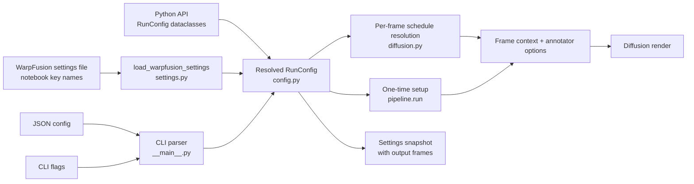
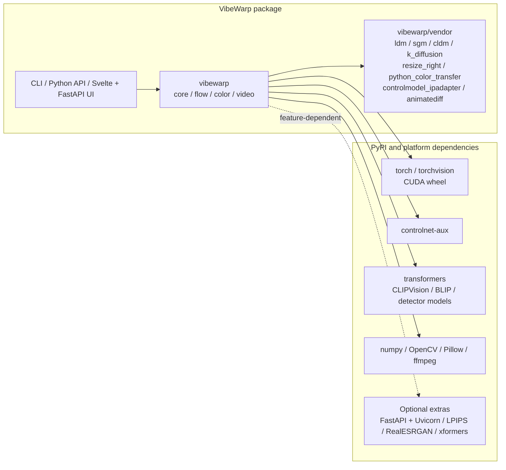

# Architecture

VibeWarp is a self-contained Python port of WarpFusion v0.37. The reference
notebook remains the behavioral source of truth; these diagrams show where its
setup, frame-rendering, and output stages live in the package.

## Render pipeline

The expensive video-wide preparation runs once. The frame loop then combines
the current source frame with the flow-warped previous render, prepares model
conditioning, runs diffusion, and saves the result for the next iteration.

The first frame has no previous render, so stylized conditioning sources fall
back to the current input frame. Later frames feed the saved result back through
the warp stage. ControlNet annotations are produced at their configured detect
resolution and converted to render-sized conditioning tensors; annotators with
crisp post-processing, such as scribble, perform that pass at render resolution.
The UNet always uses the ControlNet-capable forward; when no ControlNet is
selected its model and hint dictionaries are empty, yielding stock-equivalent
math while keeping one production path and allowing FreeU consistently.

## External image-edit models (separate render path)

`model_version="flux2_klein_edit"`, `model_version="flux2_klein_9b_edit"`,
and `model_version="hidream_o1_edit"`
bypass the CompVis/k-diffusion stack. The model-agnostic frame loop is reused:
optical-flow warping, consistency blending, pre/post color matching, frame
feedback, prompts, and output handling remain VibeWarp-owned. `core/edit.py`
dispatches the prepared RGB edit target to the selected backend.

Flux2 and HiDream-O1 share one ordered reference-image pipeline. The required
first slot and optional later slots can select the raw current frame, previous
stylized frame, or its optical-flow-warped consistency composite. Later slots
can also use a fixed uploaded style image; `none` terminates the list. Activating
a slot reveals another until the model's limit is reached. Optional `@ImageN`
tokens are alpha-blended into the exact images sent to the model using one global
opacity setting (70% by default), and the results are recorded in History.
Temporal choices fall back to raw when no prior render exists. Both Comfy graphs
begin from an empty output latent, so the images are edit conditioning rather
than a noised img2img latent.
See [Flux settings](settings.md#flux-2-klein-edit) and [HiDream
settings](settings.md#hidream-o1-edit).

## Configuration and settings flow

All entry points resolve to the same `RunConfig`. WarpFusion settings retain
their notebook key names at the file boundary and are translated in one place.
CLI arguments can override the loaded values before validation and execution.

The Svelte UI reads a schema and defaults generated directly from `RunConfig`.
Its local FastAPI server validates submitted documents with the same shared
config codec used by the CLI, then queues them for the single GPU render
worker. Job state and logs stream back over server-sent events. Model paths are
resolved during settings loading/setup; schedules remain declarative until the
frame loop selects the value for the current frame.

The schema also declares each field's compatible renderer families. Switching
between SD, Flux, and HiDream filters the form and search results immediately:
SD checkpoint, k-diffusion, tiled VAE, ControlNet, IP-Adapter, AnimateDiff,
FreeU, LORA, and reconstruction-noise controls are not shown for external edit
models, while Flux and HiDream expose only their own backend controls. Hidden
values remain in the config for lossless model switching and settings imports;
validation ignores fields that cannot affect the selected renderer.

## Dependency layout

Model implementations and WarpFusion-specific forks are shipped under
`vibewarp/vendor`, so a checkout or wheel does not depend on external git
clones. General-purpose libraries remain normal PyPI dependencies.

## Parity boundary

CPU tests cover configuration translation, scheduling, annotator transforms,
conditioning, and isolated model-forward behavior. End-to-end output parity is
closed by same-settings, same-seed GPU renders against the reference notebook,
because CUDA kernels, model weights, and full sampler composition are outside
the deterministic CPU-test boundary.
