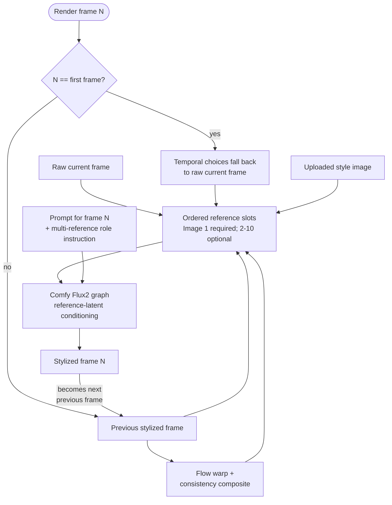

# Settings reference

Details on WarpFusion settings mapping and every configurable subsystem.
For CLI flags and usage, see [cli.md](cli.md).

## WarpFusion settings mapping

When loading a WarpFusion settings file (`--warpfusion-settings`), the
following fields are mapped automatically. CLI flags override any field from
the settings file.

**Key mappings:**

| Settings field | Config field | Notes |
|---|---|---|
| `model_path` | `sd_checkpoint_path` | Resolved relative to `models_root` |
| `model_version` | `model_version` | `control_multi` → `control_multi_v15` |
| `noise_mode` | `diffusion.noise_mode` + `reconstruction_noise.enabled` | `'default'` = randn, `'fixed'` = persistent start_code, `'reconstructed'` = DDIM inversion |
| `code_randomness` | `diffusion.code_randomness` | Blend ratio for `noise_mode='fixed'` (0 = fully fixed, 1 = fully random) |
| `guidance_use_start_code` | `diffusion.guidance_use_start_code` | Kept for RNG parity with the notebook (burns one CUDA draw per frame) |
| `steps_schedule` | `diffusion.steps` + `steps_schedule` | Dict `{frame: steps}` |
| `cfg_scale_schedule` | `diffusion.cfg_scale` + `cfg_scale_schedule` | Supports `[[v1, v2, v3]]` ramp format |
| `style_strength_schedule` | `diffusion.style_strength` | List or dict schedule |
| `flow_blend_schedule` | `warp.flow_blend_schedule` | Resolved per-frame during render |
| `controlnet_multimodel` | `controlnet.models` | JSON string → dict of CN configs |
| `cond_image_src` | `controlnet.cond_image_src` | Global CN source: `init` or `stylized` |
| `detect_resolution` | per-CN `detect_resolution` | Global fallback for per-CN `-1`/`'global'` values |
| `dynamic_thresh` | `diffusion.dynamic_thresh` | Static thresholding clamp (default 30) |
| `lora_dir` | `lora_dir` | Directory containing LORA `.safetensors` files |
| `controlnet_model_dir` | `controlnet.model_dir` | Base directory for ControlNet checkpoints; relative or omitted per-model paths resolve here |
| `soften_consistency_mask` | `flow.soften_consistency_mask` | Floor clip for CC weights (default 0) |
| `use_tiled_vae` | `vae.use_tiled_vae` | Enable tiled VAE for high-res renders |
| `num_tiles` | `vae.num_tiles` | `[rows, cols]` tile grid |
| `tile_size` | `vae.tile_size` | Tile edge in latent space (default 128) |
| `vae_stride` | `vae.vae_stride` | Stride in latent space (default 96) |
| `vae_padding` | `vae.vae_padding` | Fractional overlap `[h_frac, w_frac]` |
| `keep_audio` | `video_assembly.keep_audio` | Reattach audio from source video |
| `use_deflicker` | `video_assembly.use_deflicker` | ffmpeg deflicker filter |
| `upscale_ratio` | `video_assembly.upscale_ratio` | RealESRGAN upscale factor (1=off) |
| `upscale_model` | `video_assembly.upscale_model` | RealESRGAN model name |
| `upscale_model_path` | `video_assembly.upscale_model_path` | Path to .pth weights |
| `use_background_mask_video` | `video_assembly.use_background_mask_video` | Composite onto background |
| `invert_mask_video` | `video_assembly.invert_mask_video` | Invert alpha mask |
| `background_video` | `video_assembly.background_video` | Background type |
| `background_source_video` | `video_assembly.background_source_video` | Color or image path |
| `mask_clip_low` | `video_assembly.mask_clip_low` | Alpha mask floor threshold |
| `mask_clip_high` | `video_assembly.mask_clip_high` | Alpha mask ceiling threshold |
| `missed_consistency_schedule` | `flow.missed_consistency_schedule` | Per-frame schedule for missed CC weight |
| `overshoot_consistency_schedule` | `flow.overshoot_consistency_schedule` | Per-frame schedule for overshoot CC weight |
| `edges_consistency_schedule` | `flow.edges_consistency_schedule` | Per-frame schedule for edges CC weight |
| `consistency_blur_schedule` | `flow.consistency_blur_schedule` | Per-frame schedule for blur sigma |
| `consistency_dilate_schedule` | `flow.consistency_dilate_schedule` | Per-frame schedule for dilation radius |
| `soften_consistency_schedule` | `flow.soften_consistency_schedule` | Per-frame schedule for soften value |

**ControlNet source selection:**

Each CN in `controlnet_multimodel` has a `source` field:
- `'stylized'` → annotates the warped previous rendered frame (temporal coherence)
- `'init'` → annotates the raw video frame (structural fidelity)
- `'global'` → uses the global `cond_image_src` setting

On frame 0, `'stylized'` falls back to the raw video frame since no previous render exists.

The `preprocess` field maps to annotator type: `'PIDI'` → `softedge`, `'dw_pose'` → `dwpose`, `'depth_anything'` → `depth`, `'global'` → auto-detect from model key.

**Schedule formats supported:**

- `[value]` — constant for all frames
- `[v0, v1, v2, ...]` — one value per frame (indexed)
- `{frame: value}` — keyframe dict (with linear interpolation when `blend=True`)
- `[[v0, v1, v2]]` — WarpFusion ramp format: interpolate across diffusion steps (CFG only)

Enable `keyframes_relative_to_frame_range` to interpret frame-keyed prompts and
schedules from the selected range's start instead of from the video's frame 0.
For example, with `frame_range=[60, 70]`, `{0: 1.0, 1: 0.7}` is evaluated as
`{60: 1.0, 61: 0.7}`. The saved keys remain relative, so changing the range
start moves the schedule without rewriting it. Per-frame lists follow the same
coordinate system while this switch is enabled.

## ControlNet modes and layer weights

Each ControlNet entry has a `mode`. It is the user-facing knob; `layer_weights`
(13 values, one per UNet block) and `zero_uncond` are **derived from it**, not
set independently:

| `mode` | Layer weights | `zero_uncond` | Meaning |
|---|---|---|---|
| `balanced` | `[1.0] × 13` | off | Default — every block weighted equally |
| `controlnet` | `0.825 ** (12 - i)` | on | "ControlNet is more important" |
| `prompt` | `0.825 ** (12 - i)` | off | "My prompt is more important" |
| `custom` | your `layer_weights` | your `zero_uncond` | Hand-authored, nothing derived |

The soft curve damps the early (low-index) blocks, which is what shifts the
balance between the conditioning and the prompt. `custom` is a VibeWarp addition
— the notebook has only the first three.

This derivation runs when models are loaded, so it applies equally to WarpFusion
settings files, VibeWarp JSON, the Python API, and the web UI.

## Available ControlNets

`vibewarp/controlnet_catalog.py` is the single source of truth for which nets
exist: their keys, labels, expected checkpoint filenames, download URLs, base
model (SD1.5 / SD2.1 / SDXL), annotator, and which global detector settings apply
to each. The web UI, the settings importer, path inference, and
`--download-models` all read from it, so adding a net is a one-line change there.

Checkpoint paths resolve in this order: an explicit `path` on the entry, then the
net's expected filename inside `model_dir`. Nets whose upstream checkpoint has no
canonical name (several publish as `diffusion_pytorch_model.safetensors`) are
renamed on download so they cannot overwrite each other.

**SDXL ControlNets** ship in diffusers format, which shares no key names with the
SD1.5 (`cldm`) layout. VibeWarp converts them on load
(`core/controlnet_diffusers.py`) — no ComfyUI install is needed, unlike the original
notebook. The format is detected from the checkpoint itself, so an SDXL net works
whether you point at it explicitly or let `model_dir` resolve it. A ControlNet from
the wrong base model (an SD1.5 net on an SDXL checkpoint) is rejected up front
rather than failing with a shape mismatch mid-render.

## IP-Adapter

IP-Adapter is available on the SD1.5/SDXL render path. Set
`ipadapter.clip_vision_model_path` to an h94 image-encoder directory, one
standalone encoder checkpoint, or the WarpFusion `clip_vision` directory:

```text
models/controlnet/clip_vision/
├── clip_vision_vit_h.safetensors
└── clip_vision_vit_bigg.safetensors
```

VibeWarp selects ViT-H or ViT-bigG from the adapter name/weights. A WarpFusion
settings import discovers that directory automatically. Encoder weights stay on
CPU and move to the GPU only while an image is encoded.

The **IP-Adapter** panel sits directly below **ControlNet** on the Render tab.
Its model dropdown is filtered to the active SD1.5 or SDXL family and scans the
ControlNet model directory for matching checkpoints; a custom checkpoint path
remains available for models stored elsewhere.

Each adapter has its own image selector: Off, previous stylized frame,
previous stylized + warp + consistency, or an uploaded/fixed image. Raw-frame
input is intentionally not offered. Temporal sources are not sent on the first
configured render-range frame because there is no result from that range to
feed back yet; fixed references remain active. Legacy static paths and
`{frame: image}` schedules are still accepted when loading settings. Hooks are
installed after reconstruction-noise and ControlNet preprocessing, matching the
notebook's default delayed application.

There are two ways to condition on several images:

- Add images inside one adapter instance. They share one weight and step range.
  `concat` preserves their order as one longer token context; `add` sums the
  embeddings; `subtract` uses Image 1 minus the average of Images 2..N;
  `average` takes their mean; and `norm average` normalizes each embedding
  before averaging it.
- Add the same adapter repeatedly. Each instance has its own image list, weight,
  schedule, and combine method. The instances install independent attention
  hooks, so their weighted attention outputs are added to the UNet result.

Identical image/encoder pairs may share the cached CLIP computation without
changing either behavior. `average` is the lightest multi-image choice;
`concat` retains the most separate image information but creates a longer
attention context.

FaceID variants and the IP-Adapter + AnimateDiff batch combination are not yet
parity-complete. Regular and Plus adapters on the non-AnimateDiff path are
covered by the parity tests.

Run `download-ipadapter-models.sh` on Linux/macOS or
`download-ipadapter-models.bat` on Windows to download all regular/Plus
checkpoints and both CLIP encoders into this layout. Both scripts skip completed
files and resume interrupted `.part` downloads.

## Consistency mask

When optical flow warping is enabled (`flow_warp=True`), a 3-channel
consistency map (CC map) is generated alongside the flow field. Each channel
marks a different type of warp unreliability:

| Channel | Layer | Meaning |
|---|---|---|
| R | `missed` | Areas the forward flow couldn't reach (occlusions, motion out-of-frame) |
| G | `overshoot` | Areas where backward flow disagrees (ambiguous matches) |
| B | `edges` | Flow discontinuities near moving object boundaries |

`edge_consistency_width` is a Sobel kernel size. OpenCV requires an odd value
between 1 and 31; imported values outside that range are safely normalized
(for example, `20` becomes `21`) instead of failing during flow generation.

The current non-legacy generator follows WarpFusion v0.37's RAFT behavior,
including its magnitude-dependent flow coloring for the edge channel, 20 update
iterations for backward flow and torchvision's default 12 for forward flow, and
its distinction between the clamped flow returned immediately and the unclamped
flow cached for resumed runs. The matching defaults are `flow_lq=True` and
`missed_consistency_dilation=2`.

**Post-processing pipeline** (matches notebook `load_cc()`):

1. Weight each channel: `clip(1 - weight, 1)` — weight=0 ignores that layer, weight=1 = full effect
2. Multiply all weighted channels together
3. Binary threshold at 0.5 → hard mask
4. Morphological dilation (`consistency_dilate`) — expands unreliable regions
5. Gaussian blur (`consistency_blur`) — softens mask edges
6. Clip the floor with `soften_consistency_mask` — raises the minimum weight so some stylized content bleeds through even in inconsistent regions

**All parameters are per-frame schedulable** using the `*_schedule` variants:

```python
from vibewarp.config import RunConfig, FlowConfig

config = RunConfig(
    flow=FlowConfig(
        # Static defaults
        missed_consistency_weight=1.0,   # 0 = ignore R channel
        overshoot_consistency_weight=1.0,
        edges_consistency_weight=1.0,
        consistency_blur=1,              # gaussian sigma
        consistency_dilate=3,            # dilation radius in pixels
        soften_consistency_mask=0.0,     # 0 = hard mask, 1 = fully ignore CC

        # Per-frame schedules (override static values when set)
        soften_consistency_schedule={0: 0.0, 30: 0.3},  # ramp up softening
        missed_consistency_schedule={0: 1.0, 60: 0.5},  # reduce missed effect
    )
)
```

`soften_consistency_mask` is equivalent to WarpFusion's `forward_weights_clip`.
Values above 0 allow the warped previous render to partially "bleed through"
in inconsistent regions, which can reduce flickering at the cost of some
structural fidelity.

The effective post-processed mask used for each blend is saved as
`debug/consistency_mask_NNNNNN.png` and appears in History under **Optical
flow**. White keeps the warped stylized frame; black falls back toward the raw
current frame. Frame 0 has no mask because it has no preceding frame to warp.

## Video assembly

Post-processing options applied during video creation (configured via `VideoAssemblyConfig`):

```python
from vibewarp.config import RunConfig, VideoAssemblyConfig

config = RunConfig(
    video_assembly=VideoAssemblyConfig(
        keep_audio=True,           # attach audio from source video (ffmpeg)
        use_deflicker=True,        # ffmpeg deflicker=mode=pm:size=10 filter
        upscale_ratio=4,           # RealESRGAN upscale (1 = disabled)
        upscale_model='realesr-animevideov3',
        upscale_model_path='/models/realesr-animevideov3.pth',
        use_background_mask_video=True,   # composite onto background
        background_video='color',         # 'color', 'image', or 'init_video'
        background_source_video='black',
        invert_mask_video=False,
    )
)
```

### RealESRGAN upscaling

Upscale each output frame before encoding. Requires the `realesrgan` and `basicsr` pip packages:

```bash
pip install realesrgan basicsr
```

Download weights manually from the GitHub releases for the model you want, then set `upscale_model_path`.

| Model | Scale | Notes |
|---|---|---|
| `realesr-animevideov3` | 4× | Best for animation/illustration |
| `realesr-general-x4v3` | 4× | General purpose |
| `RealESRGAN_x4plus` | 4× | Photorealistic content |
| `RealESRGAN_x4plus_anime_6B` | 4× | Anime, lightweight |
| `RealESRGAN_x2plus` | 2× | 2× upscale |

### Audio preservation

When `keep_audio=True` and a source video is set, the audio track is remuxed
into the output without re-encoding (`-c:v copy`). If the source has no audio
stream, the error is silently suppressed and the silent video is kept.

### Video blending (post-processing)

This is WarpFusion's consistency-aware export smoothing path. Set
`video_assembly.blend_mode="optical flow"` and `flow.check_consistency=True` to
warp and blend the previous processed output using the saved flow and
forward/backward consistency map. `video_assembly.blend` and the three
`video_assembly.*_consistency_weight` fields match the notebook panel. Video
assembly uses the notebook's export mask settings (`blur=2`, `dilate=0`) rather
than the render loop's mask post-processing values. This works for SD, Flux, and
HiDream outputs.

### FFmpeg deflicker

Separately, `video_assembly.use_deflicker=True` adds the notebook's
`deflicker=mode=pm:size=10` ffmpeg filter during encoding.

This is distinct from the notebook's sampling-time `deflicker_scale` and
`deflicker_latent_scale` losses. Those require gradients inside the SD denoiser
and therefore cannot be applied through the remote ComfyUI edit backends.

### Background mask compositing

When `use_background_mask_video=True`, each output frame is composited onto a
background using pre-computed alpha masks. The masks must be in
`{video_frames_folder}_alpha/` named `{frame_num+1:06d}.jpg` (grayscale,
0=transparent 255=opaque).

Background types:
- `'color'` — solid color (CSS color string or name, e.g. `'black'`, `'#ff0000'`)
- `'image'` — path to a background image
- `'init_video'` — raw video frame for the same index

`mask_clip_low` / `mask_clip_high` threshold the mask before compositing.

## SD/SDXL temporal guidance

`diffusion.guidance_mode` selects the img2img target used after the first
rendered frame:

- `prev stylized` uses the previous output without motion compensation.
- `prev warped` uses the previous output after optical-flow warping, before
  consistency-mask compositing.
- `prev warped + cc` (default) uses the warped output composited with the
  current raw frame through the consistency mask.

The first frame in the selected range has no previous output, so it keeps the
existing raw-frame initialization. This setting applies only to SD 1.5 and
SDXL; edit-model backends continue to use their reference-image pipeline.

## Tiled sampler

The tiled sampler reduces UNet/ControlNet peak VRAM at high resolutions. It
splits the latent spatially on every denoiser evaluation, runs each overlapping
tile independently, then combines the predictions with normalized trapezoidal
blend windows before the sampler takes its next step.

```python
from vibewarp.config import DiffusionConfig, RunConfig

config = RunConfig(
    diffusion=DiffusionConfig(
        tiled_sampler=True,
        sampler_tile_size=512,
        sampler_tile_overlap=35,
        sampler_tile_split_threshold=20,
    )
)
```

These controls are in **System → Performance** in the web UI. VibeWarp derives
the row and column counts from the render dimensions and selected pixel-space
tile edge. The UI recommends 512px for SD1.5 and
AnimateDiff, or 1024px for vanilla SDXL, matching their training resolutions.

ControlNet hints and spatial image conditioning are cropped with every tile.
AnimateDiff is supported: tiling only splits height and width, never its temporal
frame batch. This is separate from tiled VAE, which only affects image
encoding/decoding.

| Field | Default | Description |
|---|---:|---|
| `tiled_sampler` | `False` | Enable per-evaluation spatial tiling |
| `sampler_tile_size` | `512` | Target tile edge in output-image pixels; grid is automatic |
| `sampler_tile_overlap` | `35.0` | Overlap between neighbouring tiles, as a percentage of the tile edge. This is the cross-fade that hides the seams. `0` = hard cuts (fastest, seams likely). |
| `sampler_tile_split_threshold` | `20.0` | Leftover a tile may absorb before another is added, as a percentage of the tile edge: `n = ceil(total/tile - threshold)`. Tiles are sized *from* the count, so without slack a 1080px side against a 1024px target splits into two ~640px tiles. `0` = the plain `ceil()` behaviour. Independent of the overlap. |

## Tiled VAE

For high-resolution renders where the full image doesn't fit in VRAM for VAE
encode/decode, enable tiled VAE:

```python
from vibewarp.config import RunConfig, VaeConfig

config = RunConfig(
    vae=VaeConfig(
        use_tiled_vae=True,
        tile_size=128,       # latent-space tile edge (128 → 1024px tiles)
        vae_stride=96,       # latent-space stride between tiles
        # OR: fractional overlap
        # vae_padding=[0.5, 0.5],  # 50% overlap
        # OR: explicit grid
        # num_tiles=[2, 2],   # 2×2 grid, tile size derived from image dims
    )
)
```

| Field | Default | Description |
|---|---|---|
| `use_tiled_vae` | `False` | Enable tiled VAE |
| `tile_size` | `128` | Tile edge in latent space (×8 = pixel size, so 128→1024px) |
| `vae_stride` | `96` | Stride between tiles in latent space |
| `vae_padding` | `None` | Fractional overlap `[h_frac, w_frac]` of tile_size (overrides `vae_stride`) |
| `num_tiles` | `None` | `[rows, cols]` grid — tile size derived from image dims (overrides `tile_size`) |

`tile_size` and `vae_stride` are in **latent space** (divide pixel dims by 8).
The default `tile_size=128` gives 1024px tiles with `vae_stride=96` (768px
stride, 256px overlap on each side).

## Noise modes

Three noise modes control how the initial noise is constructed for each frame:

| `noise_mode` | Behavior |
|---|---|
| `default` | Fresh `randn` each frame — maximum variation |
| `fixed` | Persistent `start_code` tensor mixed with per-frame randn via `code_randomness`. Lower randomness = more temporally coherent noise structure. |
| `reconstructed` | DDIM inversion of the init image — noise that "knows" the frame content. Best temporal consistency; slower (runs an extra inversion pass per frame). |

For `noise_mode='fixed'`, `code_randomness` controls the blend:
- `0.0` = fully fixed (same start_code every frame)
- `1.0` = fully random (same as `default`)
- Typical value: `0.1`–`0.3`

## Prompt features

### Multi-prompt blending

Separate prompts with `|` and optionally add a `:weight` suffix to each:

```
"impressionist painting:0.7 | anime style:0.3"
```

Weights are normalized automatically. Each sub-prompt is encoded
independently; the conditionings are blended before sampling.

### LORA scheduling

Embed LORA references directly in prompt keyframes using `<lora:name:weight>` syntax:

```python
config = RunConfig(
    lora_dir="/models/loras",
    text_prompts={
        0:  "a painting <lora:impressionist:0.8>",
        60: "a portrait <lora:impressionist:0.4> <lora:face_detail:0.6>",
    },
)
```

LORAs are loaded from `lora_dir` by filename stem (`.safetensors`, `.pt`, or
`.ckpt`). Multiple LORAs stack additively. Weights are resolved per-frame from
the keyframe schedule; a weight of 0 skips loading that LORA. Supports
A1111-format LORA files.

LORA tags are stripped from the prompt before text encoding — the clean
prompt is what gets encoded.

**Merge precision** (`lora_merge_precision`, default `'fp16'`):

- `'fp16'` — replicates the WarpFusion notebook's A1111 merge arithmetic
  exactly (up/down cast to the weight dtype before the matmul). Required for
  notebook output parity.
- `'fp32'` — computes deltas in float32 and rounds once at apply time. More
  accurate merged weights, but renders deviate slightly from the notebook.

```python
config = RunConfig(lora_dir="/models/loras", lora_merge_precision="fp32")
```

## Flux 2 Klein Edit

Selecting `model_version="flux2_klein_edit"` (4B) or
`model_version="flux2_klein_9b_edit"` (9B) switches VibeWarp to FLUX.2 Klein
on a render path entirely separate from the CompVis/k-diffusion stack. The
default backend submits a native Flux2 graph to a running ComfyUI server. The SD
checkpoint, ControlNets, IP-Adapters, LORAs, k-diffusion sampler, and VibeWarp's
tiled VAE are skipped; `FluxConfig` drives the render instead.
FLUX does not use negative prompts, so the **Negative Prompts** editor is hidden
while either FLUX model is selected. Describe the desired result positively in
the main prompt.

The warp-stylization loop is unchanged. Reference image 1 is always present and
defaults to the raw current frame. It can instead use the previous stylized frame,
or that frame after optical-flow warping and consistency compositing. Temporal
sources fall back to the raw frame when there is no previous render yet. Klein
starts from an empty noisy latent; the images are conditioning, not img2img
starting latents.

### Inputs by frame number

The **Reference Images** editor is shared with HiDream. Image 1 cannot be removed.
For image 2 and later, choose `none` (the default), a frame-derived source, or
`upload image`. Activating a slot reveals the next one, up to the model's
10-reference limit. Upload mode provides a square drag-and-drop target that also
opens the system image picker when clicked, making it suitable for a fixed style
reference. Each active image can optionally receive a short visible label:
`@Image1`, `@Image2`, and so on. One global opacity slider controls every baked
label and defaults to 70%, leaving the source pixels visible beneath the overlay
so the model can reconstruct them.



Every exact image sent to FLUX.2, including uploaded images and optional baked
labels, is saved in History/Debug.

### ComfyUI and model setup

1. Install ComfyUI from the [official download
   page](https://www.comfy.org/download), or clone the
   [official ComfyUI repository](https://github.com/Comfy-Org/ComfyUI) for a
   portable/manual install. Update it to the current version so that the native
   Flux2 nodes are available.
2. Download these three files from Hugging Face and place them below ComfyUI's
   model directory (the model directory selected during Desktop setup, or
   `<ComfyUI>/models` for portable/manual installs):

   | Hugging Face download | Destination |
   |---|---|
   | [`flux-2-klein-4b-fp8.safetensors`](https://huggingface.co/black-forest-labs/FLUX.2-klein-4b-fp8/blob/main/flux-2-klein-4b-fp8.safetensors) | `models/diffusion_models/` |
   | [`qwen_3_4b.safetensors`](https://huggingface.co/Comfy-Org/vae-text-encorder-for-flux-klein-4b/blob/main/split_files/text_encoders/qwen_3_4b.safetensors) | `models/text_encoders/` |
   | [`flux2-vae.safetensors`](https://huggingface.co/Comfy-Org/vae-text-encorder-for-flux-klein-4b/blob/main/split_files/vae/flux2-vae.safetensors) | `models/vae/` |

   The distilled FP8 model above is the file expected by VibeWarp's default
   four-step ComfyUI workflow. The complete
   [`black-forest-labs/FLUX.2-klein-4B`](https://huggingface.co/black-forest-labs/FLUX.2-klein-4B)
   repository is only needed when `flux.backend="diffusers"` is selected.

   For the 9B dropdown option, use these model-specific files instead (the VAE
   is shared):

   | Hugging Face download | Destination |
   |---|---|
   | [`flux-2-klein-9b-fp8.safetensors`](https://huggingface.co/black-forest-labs/FLUX.2-klein-9b-fp8) | `models/diffusion_models/` |
   | [`qwen_3_8b_fp8mixed.safetensors`](https://huggingface.co/Comfy-Org/vae-text-encorder-for-flux-klein-9b/blob/main/split_files/text_encoders/qwen_3_8b_fp8mixed.safetensors) | `models/text_encoders/` |
   | [`flux2-vae.safetensors`](https://huggingface.co/Comfy-Org/vae-text-encorder-for-flux-klein-4b/blob/main/split_files/vae/flux2-vae.safetensors) | `models/vae/` |

   VibeWarp switches the Comfy-visible diffusion model, text encoder, and
   Diffusers repository automatically when the model dropdown changes. Explicit
   custom filenames remain untouched.
3. Restart ComfyUI after copying the files, start its local server, and leave it
   running while VibeWarp renders. Set `flux.comfy_server_url` if its address is
   not `http://127.0.0.1:8188`.

The optional Diffusers backend also requires `pip install vibewarp[flux]`.

| Config field | Default | Notes |
|---|---|---|
| `flux.backend` | `comfy` | `comfy` uses the HTTP server; `diffusers` uses a complete Hugging Face repository. |
| `flux.comfy_server_url` | `http://127.0.0.1:8188` | ComfyUI HTTP address. |
| `flux.comfy_unet_name` | 4B: `flux-2-klein-4b-fp8.safetensors`; 9B: `flux-2-klein-9b-fp8.safetensors` | Filename visible to Comfy's `UNETLoader`; selected with the model dropdown unless customized. |
| `flux.comfy_clip_name` | 4B: `qwen_3_4b.safetensors`; 9B: `qwen_3_8b_fp8mixed.safetensors` | Filename visible to Comfy's `CLIPLoader`; selected with the model dropdown unless customized. |
| `flux.comfy_vae_name` | `flux2-vae.safetensors` | Filename visible to Comfy's `VAELoader`. |
| `flux.comfy_timeout` | `600` | Maximum seconds to wait for a submitted frame. |
| `flux.guidance_scale` | `1.0` | CFG used by the distilled reference workflow. |
| `flux.steps` | `4` | Flux2Scheduler steps, independent of `diffusion.steps_schedule`. |
| `flux.fixed_seed` | `True` | Reuse identical starting noise on every frame to reduce stochastic temporal and palette changes. |
| `flux.references` | image 1: `raw`; image 2: `none` | Ordered list of up to 10 reference slots. Image 1 accepts `raw`, `previous`, or `warped` and is always sent. Later slots also accept `upload` and `none`; `none` ends the list. Every active slot can bake its unique `@ImageN` token into the image. |
| `reference_label_opacity` | `0.7` | Shared opacity for every baked `@ImageN` label. `0` is transparent and `1` is fully opaque. |
| `flux.multi_reference_instruction` | `Use reference image 1 ...` | Plain-text instruction shown under **Prompts** and prepended when two or more references are active to assign content and style/temporal roles. |
| `flux.model_repo` | 4B: `black-forest-labs/FLUX.2-klein-4B`; 9B: `black-forest-labs/FLUX.2-klein-9B` | Used only by the Diffusers backend and selected with the model dropdown unless customized. |

> **Status:** the Comfy graph has been exercised successfully on a real Klein 4B
> FP8 checkpoint. It reproduces the default workflow's Euler sampler, four-step
> Flux2 schedule, CFG 1, empty output latent, and positive/negative
> `ReferenceLatent` conditioning.

## HiDream-O1 Edit

Selecting `model_version="hidream_o1_edit"` uses HiDream-O1's native
pixel-space instruction-edit workflow through ComfyUI. It reuses the same
outer VibeWarp loop as the SD and Flux paths: frame zero uses the raw input;
later frames use the flow-warped previous render blended with the current frame
through the consistency mask, with the configured pre/post color matching.

HiDream starts sampling from an empty pixel-space latent at denoise `1.0`. This
is intentionally not classic img2img with noise added to an encoded target. Its
**Reference Images** editor is identical to FLUX. Image 1 is required and
defaults to the raw current frame; it can instead use the previous stylized frame
or the warped/consistency-composited version. Later slots default to `none` and
can use any frame-derived source or a fixed uploaded style image. Activating a
slot reveals the next slot, up to HiDream's 10-reference limit. Temporal sources
fall back to raw on the first rendered frame. Comfy describes 2–10 references as
subject-personalization conditioning, so the text-assigned content/style roles
remain an experimental use of that path.

### ComfyUI and model setup

1. Install ComfyUI from the [official download
   page](https://www.comfy.org/download), or clone the
   [official ComfyUI repository](https://github.com/Comfy-Org/ComfyUI) for a
   portable/manual install. Update it to the current version so that the native
   HiDream-O1 nodes are available.
2. Download
   [`hidream_o1_image_fp8_scaled.safetensors`](https://huggingface.co/Comfy-Org/HiDream-O1-Image/blob/main/checkpoints/hidream_o1_image_fp8_scaled.safetensors)
   from the Comfy-Org Hugging Face repository and place it in
   `models/checkpoints/` below ComfyUI's model directory (the model directory
   selected during Desktop setup, or `<ComfyUI>/models/checkpoints` for
   portable/manual installs).
3. Restart ComfyUI after copying the checkpoint, start its local server, and
   leave it running while VibeWarp renders. Set `hidream.comfy_server_url` if
   its address is not `http://127.0.0.1:8188`.

The checkpoint is loaded by `CheckpointLoaderSimple` and includes the required
conditioning components; no separate Gemma/Qwen text-encoder file is configured
for direct prompts in VibeWarp. ComfyUI's separately downloadable
[`gemma4_e4b_it_fp8_scaled.safetensors`](https://huggingface.co/Comfy-Org/gemma-4/blob/main/text_encoders/gemma4_e4b_it_fp8_scaled.safetensors)
is an optional prompt-enhancement model, not a required core conditioning
encoder, and this first test backend bypasses that enhancement stage.

| Config field | Default | Notes |
|---|---|---|
| `hidream.comfy_server_url` | `http://127.0.0.1:8188` | ComfyUI HTTP address. |
| `hidream.comfy_checkpoint_name` | `hidream_o1_image_fp8_scaled.safetensors` | Filename visible to Comfy's checkpoint loader. |
| `hidream.comfy_timeout` | `1200` | Maximum seconds to wait for one frame. |
| `hidream.steps` | `40` | Native Full workflow steps, independent of the SD schedule. |
| `hidream.guidance_scale` | `5.0` | Classifier-free guidance value. |
| `hidream.sampler` | `dpmpp_2m_sde_gpu` | Sampler used by ComfyUI's native Full workflow. |
| `hidream.scheduler` | `normal` | Scheduler used by ComfyUI's native Full workflow. |
| `hidream.noise_scale` | `8.0` | Locks Full's absolute training noise scale, matching the native ComfyUI workflow. |
| `hidream.use_trained_resolution` | `True` | Sample at the nearest ~4MP O1 training preset, then resize to the configured video dimensions. Required for reliable output at ordinary 512–1024px video sizes. |
| `hidream.fixed_seed` | `True` | Reuse the same starting noise across frames. |
| `hidream.references` | image 1: `raw`; image 2: `none` | Ordered list of up to 10 reference slots. Image 1 is required; later slots add `none` and uploaded-image choices. Each active slot can bake its unique `@ImageN` token into the image. |
| `reference_label_opacity` | `0.7` | Shared opacity for every baked `@ImageN` label. `0` is transparent and `1` is fully opaque. |
| `hidream.multi_reference_instruction` | `Use reference image 1 ...` | Plain-text instruction shown under **Prompts** and prepended when two or more references are active. It assigns content/composition to image 1 and style/temporal continuity to the remaining images. |
| `hidream.patch_seam_smoothing` | `True` | Apply the native late-step patch seam smoother used by Full's official workflow. |
| `hidream.patch_seam_start` | `0.8` | Sampling progress at which seam smoothing begins. |
| `hidream.patch_seam_passes` | `ramp_2_4` | Shifted model evaluations in the smoothing phase; higher/ramped modes cost more time. |
| `hidream.patch_seam_blend` | `median` | How shifted late-step predictions are combined. |

The exact PNGs sent to ComfyUI are saved per frame as
`debug/hidream_reference_1_NNNNNN.png` and, in multi-reference mode,
`debug/hidream_reference_2_NNNNNN.png` (and so on). These are captured after
trained-size resampling and after optional visible labels are applied. They
appear under **Edit inputs** in History & Comparison. Comfy uploads also use
frame-specific filenames so older prompts retain the correct inputs in ComfyUI
history instead of pointing at a file overwritten by a later frame.

> **Status:** validated live with the FP8-scaled Full checkpoint through ComfyUI
> on an RTX 4090 Laptop GPU. Square 2048x2048 sampling produced a clean edit;
> direct 1024x1024 sampling produced noise, so trained-resolution sampling is
> enabled by default.

## Qwen Image Edit 2511

Selecting `model_version="qwen_image_edit_2511"` uses the native INT8 ConvRot
transformer, while `model_version="qwen_image_edit_2511_gguf"` selects the
Q5_K_M GGUF transformer for a lower-VRAM comparison. Both run
Qwen-Image-Edit-2511 through ComfyUI with the same encoder, VAE, Lightning
LoRA, prompts, and sampling settings. They keep negative prompts enabled and use the same ordered
**Reference Images** editor as the other edit models, capped at Qwen's native
three image inputs. Image 1 is encoded as the editable latent; images 2 and 3
can provide style or other visual references. The multi-reference instruction
under **Prompts** is prepended only when more than one image is active.
On the first rendered frame, unavailable optional previous/warped references
are not sent; a temporal source selected for required Image 1 falls back to the
raw frame.

### ComfyUI and model setup

1. Install or update ComfyUI from the [official download
   page](https://www.comfy.org/download) or the
   [official repository](https://github.com/Comfy-Org/ComfyUI). Qwen 2511 uses
   current native nodes including `TextEncodeQwenImageEditPlus`.
   For the GGUF mode, also install
   [ComfyUI-GGUF](https://github.com/city96/ComfyUI-GGUF).
2. Download the following files and place them under ComfyUI's model directory:

   | Hugging Face download | Destination |
   |---|---|
   | [`qwen_image_edit_2511_int8_convrot.safetensors`](https://huggingface.co/Comfy-Org/Qwen-Image-Edit_ComfyUI/blob/main/split_files/diffusion_models/qwen_image_edit_2511_int8_convrot.safetensors) | `models/diffusion_models/` |
   | [`Qwen-Image-Edit-2511-Q5_K_M.gguf`](https://huggingface.co/vantagewithai/Qwen-Image-Edit-2511-GGUF/blob/main/Qwen-Image-Edit-2511-Q5_K_M.gguf) | `models/unet/` |
   | [`qwen_2.5_vl_7b_fp8_scaled.safetensors`](https://huggingface.co/Comfy-Org/HunyuanVideo_1.5_repackaged/tree/main/split_files/text_encoders) | `models/text_encoders/` |
   | [`qwen_image_vae.safetensors`](https://huggingface.co/Comfy-Org/Qwen-Image_ComfyUI/blob/main/split_files/vae/qwen_image_vae.safetensors) | `models/vae/` |
   | [`Qwen-Image-Edit-2511-Lightning-8steps-V1.0-bf16.safetensors`](https://huggingface.co/lightx2v/Qwen-Image-Edit-2511-Lightning/blob/main/Qwen-Image-Edit-2511-Lightning-8steps-V1.0-bf16.safetensors) | `models/loras/` |

3. Restart ComfyUI, leave its server running, and select **Qwen Image Edit
   2511** or **Qwen Image Edit 2511 GGUF** in VibeWarp. If the server is not on
   `http://127.0.0.1:8188`, change `qwen.comfy_server_url` under
   **System → Paths**. The UI reports when the configured Comfy port is
   unavailable.

The graph follows ComfyUI's [official Qwen Image Edit 2511
workflow](https://docs.comfy.org/tutorials/image/qwen/qwen-image-edit-2511):
Qwen image conditioning for both positive and negative prompts, AuraFlow shift
`3.1`, CFG normalization, Euler/simple sampling, and the first reference encoded
as the starting latent. The default path applies LightX2V's 8-step Lightning
LoRA after CFG normalization. Disable **Use Lightning LoRA** and restore 40
steps / CFG 4 for the undistilled base workflow.

| Config field | Default | Notes |
|---|---|---|
| `qwen.comfy_server_url` | `http://127.0.0.1:8188` | ComfyUI HTTP address. |
| `qwen.comfy_unet_name` | Native: `qwen_image_edit_2511_int8_convrot.safetensors`; GGUF: `Qwen-Image-Edit-2511-Q5_K_M.gguf` | Selected by the model dropdown and loaded with `UNETLoader` or `UnetLoaderGGUF`. |
| `qwen.comfy_clip_name` | `qwen_2.5_vl_7b_fp8_scaled.safetensors` | Qwen 2.5 VL text/vision encoder visible to `CLIPLoader`. |
| `qwen.comfy_vae_name` | `qwen_image_vae.safetensors` | Official Qwen Image VAE filename visible to `VAELoader`. |
| `qwen.comfy_lora_name` | `Qwen-Image-Edit-2511-Lightning-8steps-V1.0-bf16.safetensors` | Filename visible to `LoraLoaderModelOnly`. |
| `qwen.use_lightning_lora` | `True` | Apply the 8-step distilled LoRA. |
| `qwen.lora_strength` | `1.0` | Lightning model strength. |
| `qwen.steps` | `8` | Lightning inference steps. Use 40 when the LoRA is disabled. |
| `qwen.guidance_scale` | `1.0` | Lightning CFG. Use 4 when the LoRA is disabled. |
| `qwen.sampling_shift` | `3.1` | AuraFlow model-sampling shift from the official workflow. |
| `qwen.references` | image 1: `raw`; image 2: `none` | Up to three ordered images. |
| `qwen.fixed_seed` | `True` | Reuse starting noise across frames for temporal stability. |

## Mage-Flow Edit

Selecting `model_version="mage_flow_edit"` runs Microsoft's RL-aligned
[Mage-Flow-Edit](https://huggingface.co/microsoft/Mage-Flow-Edit) checkpoint at
30 steps and CFG 5. Selecting `model_version="mage_flow_edit_turbo"` switches
to the distilled 4-step checkpoint at CFG 1. Both use ComfyUI's native
`TextEncodeMageFlowEdit` node, keep negative prompts enabled, and support up to
16 ordered reference images. The multi-reference instruction under
**Prompts** is prepended only when more than one image is active.

### ComfyUI and model setup

1. Install or update ComfyUI from the [official download
   page](https://www.comfy.org/download) or the
   [official repository](https://github.com/Comfy-Org/ComfyUI). Mage requires a
   current build containing `TextEncodeMageFlowEdit` and the `mage` CLIP type.
2. Download the following official ComfyUI repacks and place them under
   ComfyUI's model directory:

   | Hugging Face download | Destination |
   |---|---|
   | [`mage_flow_edit_int8_convrot.safetensors`](https://huggingface.co/Comfy-Org/Mage-Flow/blob/main/diffusion_models/mage_flow_edit_int8_convrot.safetensors) | `models/diffusion_models/` |
   | [`mage_flow_edit_turbo_int8_convrot.safetensors`](https://huggingface.co/Comfy-Org/Mage-Flow/blob/main/diffusion_models/mage_flow_edit_turbo_int8_convrot.safetensors) | `models/diffusion_models/` |
   | [`qwen3vl_4b_bf16.safetensors`](https://huggingface.co/Comfy-Org/Mage-Flow/blob/main/text_encoders/qwen3vl_4b_bf16.safetensors) | `models/text_encoders/` |
   | [`mage_flow_vae_bf16.safetensors`](https://huggingface.co/Comfy-Org/Mage-Flow/blob/main/vae/mage_flow_vae_bf16.safetensors) | `models/vae/` |

   Only the edit checkpoint for the mode you intend to use is required. BF16
   edit checkpoints are also available in the same repository, but the INT8
   ConvRot presets are the lower-VRAM defaults in VibeWarp.
3. Restart ComfyUI, leave its server running, and select **Mage Flow Edit** or
   **Mage Flow Edit Turbo** in VibeWarp. If the server is not on
   `http://127.0.0.1:8188`, change `mage.comfy_server_url` under
   **System → Paths**. The UI reports when the configured Comfy port is
   unavailable.

The submitted graph loads the transformer, Qwen3-VL encoder, and Mage VAE;
passes every active image to `TextEncodeMageFlowEdit`; and samples the latent
returned by that node with Euler/simple before VAE decode. ComfyUI supplies
Mage's native flow-sampling shift from the checkpoint model configuration.
Reference images are resized to the requested output resolution by the native
conditioning node.

| Config field | Standard default | Turbo default / notes |
|---|---|---|
| `mage.comfy_server_url` | `http://127.0.0.1:8188` | ComfyUI HTTP address. |
| `mage.comfy_unet_name` | `mage_flow_edit_int8_convrot.safetensors` | Turbo: `mage_flow_edit_turbo_int8_convrot.safetensors`; selected with the model dropdown. |
| `mage.comfy_clip_name` | `qwen3vl_4b_bf16.safetensors` | Qwen3-VL 4B text/vision encoder visible to `CLIPLoader`. |
| `mage.comfy_vae_name` | `mage_flow_vae_bf16.safetensors` | Mage VAE visible to `VAELoader`. |
| `mage.steps` | `30` | Turbo: `4`. |
| `mage.guidance_scale` | `5.0` | Turbo: `1.0`. |
| `mage.sampler` / `mage.scheduler` | `euler` / `simple` | Shared by both presets. |
| `mage.references` | image 1: `raw`; image 2: `none` | Up to 16 ordered images. |
| `mage.fixed_seed` | `True` | Reuse starting noise across frames for temporal stability. |

## Color matching

Color matching is split into two independent groups under **Advanced**:

- **Color Match — Before Diffusion** colorizes raw/current video pixels toward
  the warped previous frame before consistency-mask blending. This keeps raw
  pixels revealed by the consistency mask from introducing the source video's
  palette into the model input.
- **Color Match — After Diffusion** matches each new model output toward the
  previous frame's warped palette before saving it and feeding it into the next
  frame. This reduces inter-frame palette drift.

Each stage has its own `enabled`, `strength`, `method`, and `regrain` setting:

| Stage | Enable | Strength | Method | Regrain |
|---|---|---|---|---|
| Before | `color.before_enabled` | `color.before_strength` | `color.before_method` | `color.before_regrain` |
| After | `color.after_enabled` | `color.after_strength` | `color.after_method` | `color.after_regrain` |

The old shared `match_color_strength`, `colormatch_method`,
`colormatch_regrain`, and `colormatch_mode` fields remain import-compatible but
are hidden from the UI. Legacy `before`, `after`, and `both` modes migrate to
the corresponding independent enable toggles.

## Vendored libraries

VibeWarp vendors everything it needs in `vibewarp/vendor/` — no external git
clones required.

| Vendor | Source | Used for |
|---|---|---|
| `k_diffusion` | [Sxela/k-diffusion](https://github.com/Sxela/k-diffusion) (fork of crowsonkb/k-diffusion) | Samplers and sigma schedules (+ `sample_lcm` from the ComfyUI fork, WarpFusion callback semantics) |
| `ldm` | [CompVis/stable-diffusion](https://github.com/CompVis/stable-diffusion) | SD model architecture (pytorch-lightning stripped) |
| `cldm` | [lllyasviel/ControlNet](https://github.com/lllyasviel/ControlNet) | ControlNet model loading |
| `sgm` | [Sxela/generative-models](https://github.com/Sxela/generative-models) (fork of Stability-AI/generative-models) | SDXL model stack (DiffusionEngine, conditioner, VAE — full inference subset, pytorch-lightning stripped) |
| `resize_right` | [assafshocher/ResizeRight](https://github.com/assafshocher/ResizeRight) | Antialiased image resizing |
| `python_color_transfer` | [pengbo-learn/python-color-transfer](https://github.com/pengbo-learn/python-color-transfer) | Color matching between frames |
| `controlmodel_ipadapter` | [Sxela/sxela-stablediffusion](https://github.com/Sxela/sxela-stablediffusion) | IP-Adapter UNet cross-attention hooks (+ bundled uncond CLIP embeds) |
| `animatediff_mm` | [ArtVentureX/comfyui-animatediff](https://github.com/ArtVentureX/comfyui-animatediff) + notebook extensions | AnimateDiff motion modules (SD1.5 v1/v2/v3, SDXL/HotshotXL), UNet injection, beta-schedule registration |
